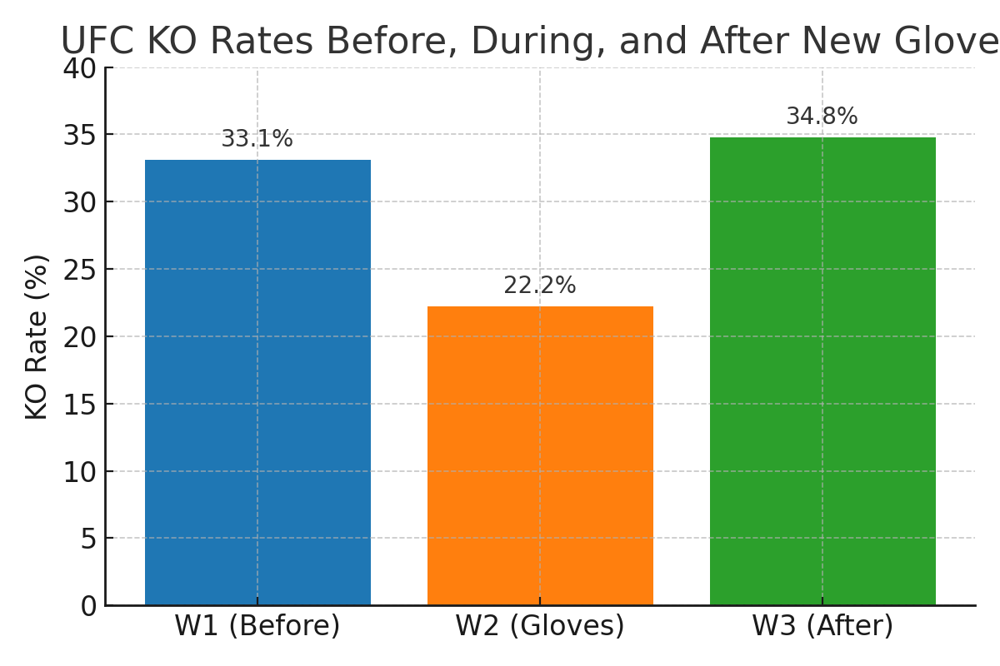

# Gloves Off? Evaluating the Impact of UFC’s Short-Lived Glove Redesign on Fight Outcomes  

## Overview  
This repository contains the data and analysis for our study on the UFC’s short-lived glove redesign in 2024. The gloves were introduced to reduce eye pokes and hand injuries, but early commentary suggested they may have also changed fight dynamics.  
Our analysis asks: **Did the glove redesign measurably affect knockout rates and other fight outcomes?**

---

## Results at a Glance  

### Knockout Rates Across Windows  

| Window | Time Period | KO Rate | # of Fights | Difference vs W2 |
|--------|-------------|---------|-------------|------------------|
| **W1** | Before Gloves | 33.1% | 248 | −10.9 pts (p=0.007) |
| **W2** | New Gloves | **22.2%** | 239 | – |
| **W3** | After Gloves | 34.8% | 224 | −12.7 pts (p=0.0025) |

👉 **KO rates dipped significantly during the glove window.**  

---

### Knockdowns Per Fight  

| Window | Knockdowns/Fight | Difference vs W2 |
|--------|------------------|------------------|
| **W1** | 0.407 | −0.098 (borderline) |
| **W2** | **0.310** | – |
| **W3** | 0.438 | −0.128 (significant) |

---

## Visualization  

Here’s a visualization of KO rates before, during, and after the glove window:  



---

## Key Takeaways  
- **KO finishes:** Significantly lower in W2 vs both before and after.  
- **Knockdowns:** Also dipped in W2 (significant vs W3).  
- **Striking & grappling:** Activity levels similar across all windows.  
- **Implication:** Equipment design—even small tweaks—can measurably alter competitive outcomes in combat sports.  

---

## How to Reproduce  
1. Clone the repo  
   ```bash
   git clone https://github.com/yourusername/ufc-gloves-impact.git
   cd ufc-gloves-impact
   ```  
2. Install requirements  
   ```bash
   pip install -r requirements.txt
   ```  
3. Run the analysis  
   ```bash
   python analysis/run_analysis.py
   ```  

---

## License  
Open-source under the MIT License.  
